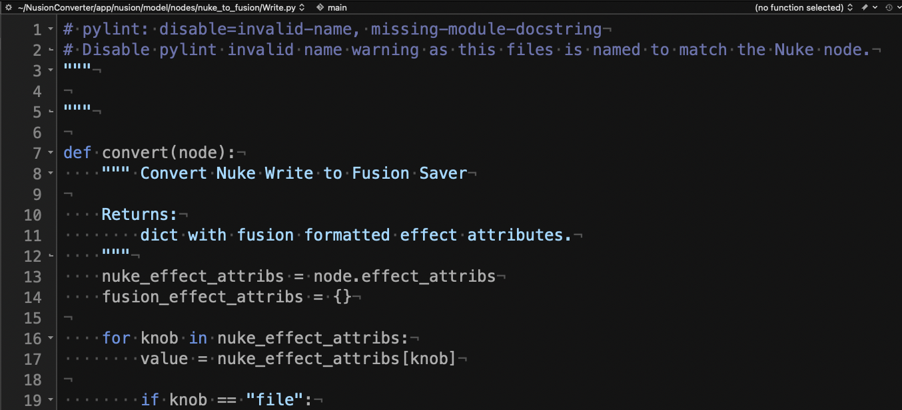
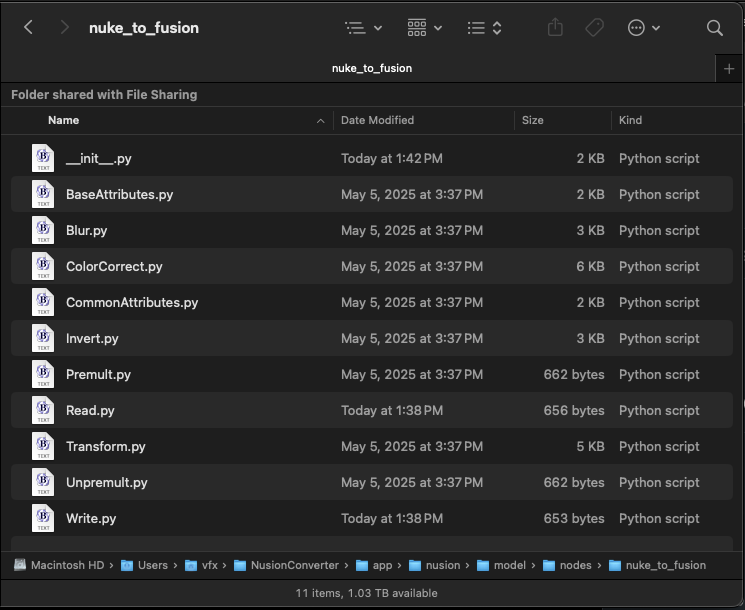
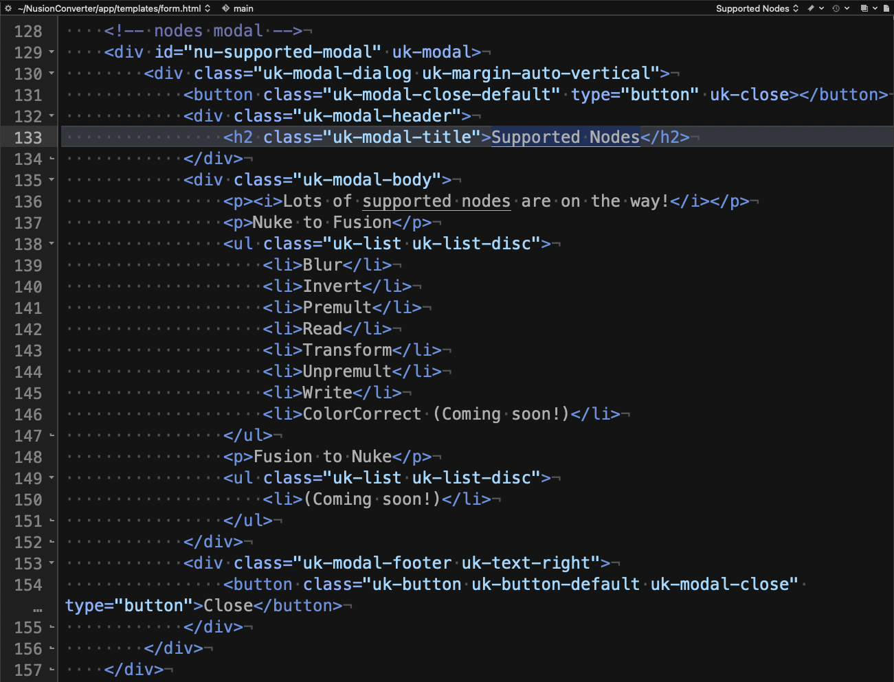

# Add Support for New Nodes

One of Nusion's most powerful features is that you can add support for additional Nuke nodes with only a few small changes to the included Python scripts. This makes it possible to map any Nuke node to a corresponding Fusion native node, 3rd party FusionSDK node, fuse, or potentially to a custom Fusion macro.

## Create a new Node Entry

1. Start by creating a new python script that has a filename prefix that matches the Nuke node name you want to add support for:

- app/nusion/model/nodes/nuke_to_fusion/&lt;node-name&gt;.py

For example, if the Nuke node name is "Write", then the Python script would be called "Write.py".



To make this task easier, there are existing node definition scripts in the "nuke_to_fusion" folder that you can copy and adapt.



2. To let Nusion know that a new node type exists, the "nuke_to_fusion" folder has an "\_\_init\_\_.py" file that needs to be edited as well. The file is located at:

- app/nusion/model/nodes/nuke_to_fusion/\_\_init\_\_.py

Start by adding the Nuke node name to the end of the import items on this line:

```py
from nusion.model.nodes.nuke_to_fusion import   BaseAttributes, \
```


Lower down in the script, in the "def convert(node)" section you need to add an extra "node.effect" entry for the Nuke node you want to add support for:

```py
if node.effect == "Write":
    return base_attribs, {**common_attribs, **Premult.convert(node)}
```


3. Update the config.py file to define how the node names are mapped during the conversion process:

- app/nusion/model/config.py

Edit the "NUKE_TO_FUSION_NODE_NAMES = {" section to add the mapping from the original Nuke node name to the appropriate Fusion node name:

```py
"Write": "Saver",
```


## Update the HTML Docs

Finally, you can edit the Nusion Web app's HTML code to indicate the node is now a supported node type. The file is located at:

- app/templates/form.html

Look for the HTML code that starts on the line and then add your node to the list:

```html
<h2 class="uk-modal-title">Supported Nodes</h2>
```


