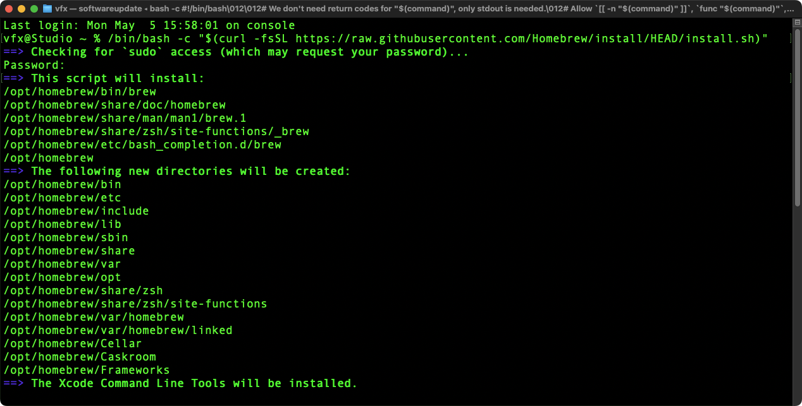
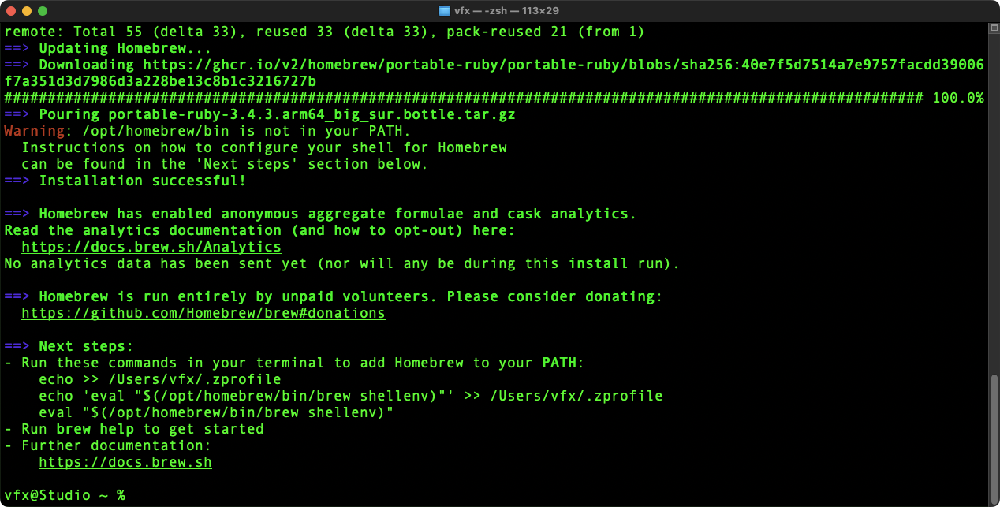
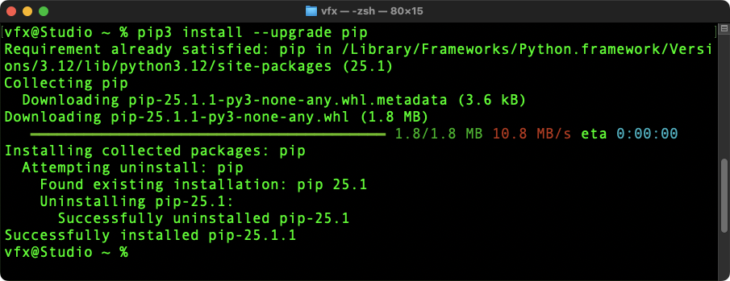

# Nusion for macOS Install

Install a recent version of Python 3.x from the official [Python org website](https://www.python.org/downloads/).

Install the Homebrew package manager:

```bash
/bin/bash -c "$(curl -fsSL https://raw.githubusercontent.com/Homebrew/install/HEAD/install.sh)"
echo >> $HOME/.zprofile
echo 'eval "$(/opt/homebrew/bin/brew shellenv)"' >> HOME/.zprofile
eval "$(/opt/homebrew/bin/brew shellenv)"
```




Create a new Python virtual environment:

```bash
cd $HOME/
python3 -m venv nusion
source $HOME/nusion/bin/activate
```


Clone the repo and install the dependencies using Homebrew and Python pip package managers:

```bash
brew install npm
pip3 install --upgrade pip
pip3 install flask
cd $HOME/
git clone https://github.com/AndrewHazelden/NusionConverter.git
cd $HOME/NusionConverter/
pip3 install -r requirements.txt
```





Activate the Python virtual environment and start the Flask app:

```bash
source $HOME/nusion/bin/activate
cd $HOME/NusionConverter/app
flask run
```


Open a webbrowser session to view the web app:

```bash
open http://127.0.0.1:5000/
```


## Create a NusionServer Standalone App Package

Now that we have a working flask development setup, we can package the Nusion Web app resources into a self-contained standalone application. 

This will produce an executable program named "NusionServer.app" that can be launched from the desktop by double-clicking on it.

This technique is made possible through the use of Python tool called [pyinstaller](https://pyinstaller.org/en/stable/spec-files.html#spec-file-options-for-a-macos-bundle).

Let's add pyinstaller to the existing nusion virtual environment:

```bash
source $HOME/nusion/bin/activate
pip3 install pyinstaller
```

Let's package the flask based"app/app.py" file using pyinstaller:

```bash
source $HOME/nusion/bin/activate
cd $HOME/NusionConverter/
pyinstaller NusionServer.spec
```

Note: A PyInstaller NusionServer.spec file is being prepared at this time. It will be available shortly.
