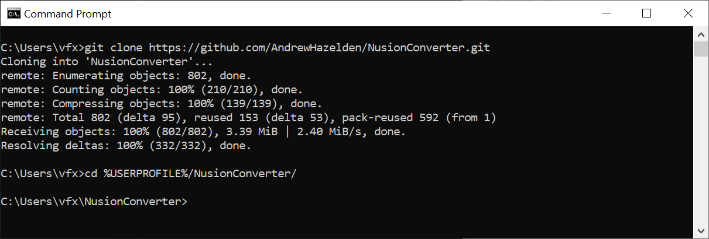

# Nusion for Windows Install

Let's use the Winget package manager to install NodeJS / NPM in the Command Prompt window:

```bash
winget install OpenJS.NodeJS
```

Python 3.13 can be installed using Winget in the Command Prompt window:

```bash
winget install python.python.3.13
```

git can be installed using Winget in the Command Prompt window:

```bash
winget install git.git
```

Create a new Python virtual environment:

```bash
cd %USERPROFILE%
python -m venv nusion
%USERPROFILE%/nusion/Scripts/activate.bat
```


Clone the repo, and install the dependencies using the Python pip package manager:

```bash
python -m pip install --upgrade pip
pip install flask
cd %USERPROFILE%
git clone https://github.com/AndrewHazelden/NusionConverter.git
cd %USERPROFILE%/NusionConverter/
pip install -r requirements.txt
```




Activate the Python virtual environment and start the Flask app:

```bash
%USERPROFILE%/nusion/Scripts/activate.bat
cd %USERPROFILE%/NusionConverter/app
flask run
```


Open a webbrowser session to view the web app:

```bash
start http://127.0.0.1:5000/
```


