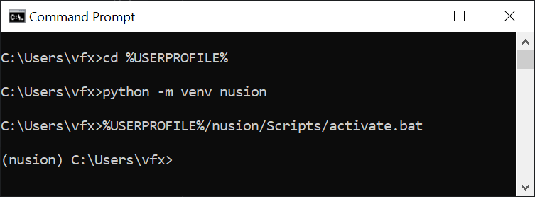

# Nusion for Windows Install

Let's use the Winget package manager to install NodeJS / NPM in the Command Prompt window:

```bash
winget install OpenJS.NodeJS
```

Python 3.13 can be installed using Winget in the Command Prompt window:

```bash
winget install python.python.3.13
```

git can be installed using Winget in the Command Prompt window:

```bash
winget install git.git
```

Create a new Python virtual environment:

```bash
cd %USERPROFILE%
python -m venv nusion
%USERPROFILE%/nusion/Scripts/activate.bat
```



Clone the repo, and install the dependencies using the Python pip package manager:

```bash
python -m pip install --upgrade pip
pip install flask
cd %USERPROFILE%
git clone https://github.com/AndrewHazelden/NusionConverter.git
cd %USERPROFILE%/NusionConverter/
pip install -r requirements.txt
```


Activate the Python virtual environment and start the Flask app:

```bash
%USERPROFILE%/nusion/Scripts/activate.bat
cd %USERPROFILE%/NusionConverter/app
flask run
```


Open a webbrowser session to view the web app:

```bash
start http://127.0.0.1:5000/
```


## Create a NusionServer Standalone App Package

Now that we have a working flask development setup, we can package the Nusion Web app resources into a self-contained standalone application. 

This will produce an executable program named "NusionServer.exe" that can be launched from the desktop by double-clicking on it.

This technique is made possible through the use of Python tool called [pyinstaller](https://pyinstaller.org/en/stable/spec-files.html#spec-file-options-for-a-macos-bundle).

Let's add pyinstaller to the existing nusion virtual environment:

```bash
%USERPROFILE%/nusion/Scripts/activate.bat
pip install pyinstaller
```

Let's package the flask based"app/app.py" file using pyinstaller:

```bash
%USERPROFILE%/nusion/Scripts/activate.bat
cd %USERPROFILE%/NusionConverter/
pyinstaller NusionServer.spec
```

Note: A PyInstaller NusionServer.spec file is being prepared at this time. It will be available shortly.


